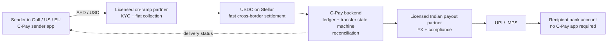

# C-Pay

Inbound remittance infrastructure on Stellar, with UPI/IMPS as the Indian last mile.

> Today, C-Pay is a self-custody Stellar wallet that abstracts away fees, trustlines, and seed phrases, piloted with real users, and being pointed at the India inbound-remittance corridor.

## The product direction

A worker in Dubai sends value through a licensed on-ramp. USDC settles on Stellar. A licensed Indian payout partner converts it and sends INR to the recipient's bank account through UPI or IMPS. The recipient does not need C-Pay, a crypto wallet, or any knowledge of blockchain.

UPI is not the competitor. It is the final domestic delivery rail that C-Pay should plug into after the cross-border transfer and regulated conversion are complete.

India was the world's largest remittance recipient in 2024, with an estimated **$129 billion** in inflows. The World Bank measured the average cost of sending $200 to South Asia at **4.48% in Q4 2024**. Those figures describe the opportunity without claiming that the current prototype already operates a regulated remittance service.

Sources: [World Bank — 2024 remittance flows](https://blogs.worldbank.org/en/peoplemove/in-2024--remittance-flows-to-low--and-middle-income-countries-ar), [World Bank Remittance Prices Worldwide, Q4 2024](https://remittanceprices.worldbank.org/sites/default/files/rpw_main_report_and_annex_q424_13.pdf).

## Target architecture



The target ledger service is authoritative: it ingests Horizon activity, owns an idempotent transfer state machine, and reconciles the chain against both partners. Clients display server-confirmed state; they do not declare that money moved.

## What exists today

The repository currently contains a testnet wallet prototype, not a production remittance product.

- Expo/React Native app with Supabase email OTP, PIN and optional biometric unlock.
- Locally created Stellar keypair with an encrypted cloud recovery backup.
- Human-readable C-Pay IDs, QR send/receive flows, and transaction history.
- Sponsored Stellar account creation, trustline setup, and relayed fee-bump payments.
- Express relayer with authentication hooks, rate limits, idempotency controls, health reporting, and Horizon ingestion.
- Supabase schemas and migrations for users, wallet backups, and transaction records.

The current default rail is Stellar testnet and still uses the project's legacy CPINR test asset. CPINR has no monetary value, backing, or redemption path. The current Add Money flow is a test-token faucet, not a deposit product or fiat bridge. Neither belongs in the target architecture; the target settlement asset is Circle-issued USDC and real money-in/out requires licensed partners.

No claim in this README should be read as saying C-Pay currently provides FX, regulated custody, KYC/AML services, a fiat on-ramp, an INR payout, or a production remittance service. Those capabilities depend on partner contracts, compliance design, and production implementation that do not exist here yet.

## Why Stellar remains useful

Stellar gives the project a low-latency settlement rail, asset trustlines, and transaction finality while the relayer hides network fees and account-reserve details from users. Stellar documents USDC support and the canonical issuers for testnet and public network in its [USDC payment documentation](https://developers.stellar.org/docs/build/agentic-payments/x402).

The chain is one component of the corridor. Partner onboarding, fiat collection, FX disclosure, payout, reconciliation, refunds, sanctions screening, transaction monitoring, and customer support remain off-chain responsibilities.

## Repository

```text
C-Pay/
├── App/                 Expo React Native wallet
├── relayer-service/     Express relayer and Horizon ingest worker
├── Blockchain/          Stellar account and test-asset setup scripts
├── supabase/            Database migrations
├── Contract/            Legacy Soroban experiment
├── docs/                Security and operating notes
└── PRODUCT_PLAN.md      Product and architecture analysis
```

## Local development

This is a multi-service prototype. Each directory has its own configuration and package scripts.

1. Apply the Supabase schema/migrations in `supabase/`.
2. Configure the Stellar testnet accounts and asset described in `Blockchain/README.md`.
3. Configure and start the relayer from `relayer-service/`.
4. Configure the Expo environment and start the app from `App/`.

Never commit Stellar secret seeds, Supabase service-role keys, wallet recovery passwords, or production partner credentials. Testnet assets have no monetary value.

## Product boundary

C-Pay's intended role is software orchestration and a better sender experience across licensed providers. It should not issue an INR-pegged token, hold customer INR, pretend a faucet is an on-ramp, or ask Indian recipients to install a blockchain wallet merely to receive a bank payout.

The immediate engineering direction is to make the existing wallet and relayer honest, secure, and suitable as a pilot vehicle while the regulated on-ramp and payout relationships are designed separately.

## Contributing

Issues and pull requests should distinguish clearly between:

- behavior that works in the current testnet prototype;
- target-architecture work that is not yet available to users; and
- regulated partner capabilities that cannot be implemented by application code alone.

Please do not describe planned functionality as shipped.

## License

See [LICENSE](LICENSE).
